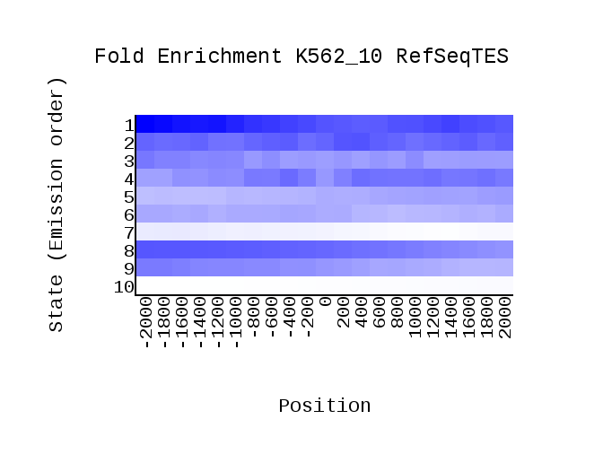

# hse_hw3_chromhmm

## Ссылка на Colab
[Colab](https://colab.research.google.com/drive/1CzfMagpVcoFWGT8g-FG0iwCAdKxGJkff?usp=sharing)

## Список 10-ти гистоновых меток

|   Номер   | Название | Файл |
|:---------:|:--------:|:----:|
|1          |H3K4me3  |wgEncodeBroadHistoneK562H3k4me3StdAlnRep1.bam|
|2          |H3k9ac   |wgEncodeBroadHistoneK562H3k9acStdAlnRep1.bam |
|3          |H3k4me1  |wgEncodeBroadHistoneK562H3k4me1StdAlnRep1.bam|
|4          |H3k4me2   |wgEncodeBroadHistoneK562H3k4me2StdAlnRep1.bam |
|5          |H3k27ac   |wgEncodeBroadHistoneK562H3k27acStdAlnRep1.bam |
|6          |H3K9me3   |wgEncodeBroadHistoneK562H3k9me3StdAlnRep1.bam |
|7          |H3K36me3    |wgEncodeBroadHistoneK562H3k36me3StdAlnRep1.bam  |
|8          |H3K79me2   |wgEncodeBroadHistoneK562H3k79me2StdAlnRep1.bam |
|9          |H4K20me1  |wgEncodeBroadHistoneK562H4k20me1StdAlnRep1.bam|
|10         |H3K9me1      |wgEncodeBroadHistoneHuvecH3k9me1StdAlnRep1.bam    |

Файл контроля: wgEncodeBroadHistoneK562ControlStdAlnRep1.bam 

## ChromHMM
RefSeqTES | RefSeqTSS 
 --- | --- 
 | 

Emission | Overlap | Transition 
 --- | --- | ---
 |  | 

## Genome Browser

## States:
State 1 - Active Promoter \
State 2 - Weak Promoter \
State 3 - Inactive/poised Promoter \
State 4 - Strong enhancer \
State 5 - Strong enhancer \
State 6 - Weak/poised enhancer \
State 7 - Weak/poised enhancer \
State 8 - Insulator \
State 9 - Transcriptional transition \
State 10 - Transcriptional elongation \
State 11 - Weak transcribed \
State 12 - Polycomb-repressed \
State 13 - Heterochromatin; low signal \
State 14 - Repetitive/Copy Number Variation \
State 15 - Repetitive/Copy Number Variation

Состояния *Promoters* выражены на H3K4me1, H3K4me2, H3K4me3, H3k9ac, H3k27ac (судя по emission и пикам состояния в начале)

Состояния _Enhancers_ выражены на H3K79me2 и H3K4me1

_Heterochromatin_ выражен на H3K9m3 (чаще всего находятся на ядерной ламине, то есть попадает на участок репрессированного гетерохроматима и не попадает на ген)

